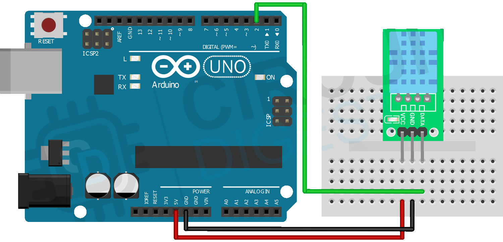

# DHT11-lib

Arduino library for the DHT11 temperature-humidity sensor. Created by Stephen Harris.

This library was created for a class project at Utah Tech University.

---

For an example of how to use this library, check out the [example program](./example/example.ino) for the Arduino Uno.

For the documentation of the various methods of the DHT11 class, consult this resource:

[DHT11-lib Documentation](./documentation.pdf)

---

## How to Install

1) Compress the files within `DHT11_lib/` to a zip file named `DHT11_lib.zip`

2) In the *Arduino* IDE, navigate to Sketch > Include *Library* > Add .ZIP *Library*.

3) From Arduino's file explorer, navigate to the location of `DHT11_lib.zip` and open it. From there the library should be accessible from your Arduino sketch.

---

For more information regarding the DHT11 sensor, check out this resource:

[DHT11 datasheet](https://www.mouser.com/datasheet/2/758/DHT11-Technical-Data-Sheet-Translated-Version-1143054.pdf)

---

Example circuit using the DHT11 sensor:

[*Image source*](https://circuitdigest.com/microcontroller-projects/interfacing-dht11-sensor-with-arduino)
